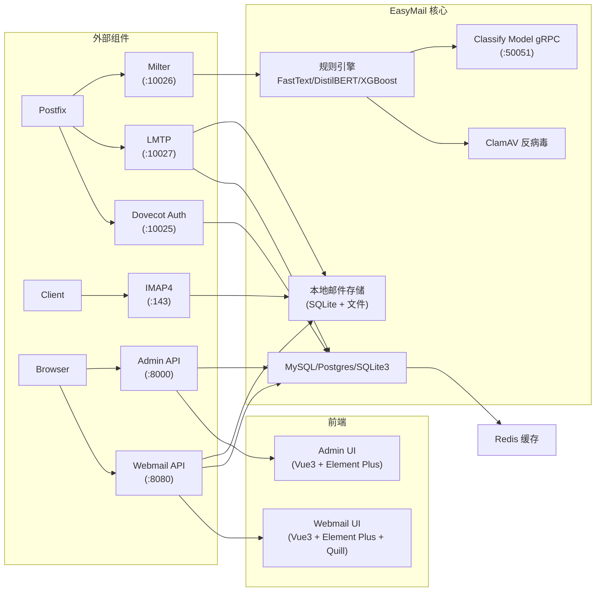

# EasyMail

[**English**](README.md) | [**中文**](README-cn.md)

**EasyMail** 是一个基于 Go 和 TypeScript 构建的开源全栈邮件系统。集成了 SMTP 网关（Milter）、邮件投递（LMTP）、IMAP4 服务器、Dovecot 认证、Webmail 前端、管理后台，以及内置的**反垃圾邮件 AI 引擎**，支持 FastText / DistilBERT / XGBoost 分类器。

- **许可证**: AGPLv3
- **语言**: Go 1.25+（后端），TypeScript/Vue 3（前端）
- **作者**: bob.xiao

---

## 功能与亮点

### 单二进制部署完整邮件基础设施

EasyMail 替代了对 Dovecot（认证 + IMAP）、Rspamd/SpamAssassin 以及自定义邮件管理后台的需求。单个 Go 二进制即可运行：
- **Milter** - SMTP 过滤网关（Postfix 集成）
- **LMTP** - 本地邮件投递
- **IMAP4rev2** - 符合 RFC 9051 规范，支持 IDLE
- **Dovecot Auth 协议** - SASL 认证
- **Admin API** - 管理 HTTP API
- **Webmail API** - 用户 HTTP API

### 内置 AI 反垃圾邮件引擎

- **多阶段规则引擎** - 在 connect、HELO、MAIL FROM、RCPT TO、headers 和 body 阶段进行评估
- **可插拔特征提取器** - 可扩展的自定义特征提取架构
- **多分类器支持** - FastText、DistilBERT（ONNX）、XGBoost
  - 通过管理后台训练自定义模型
  - 邮件投递时实时推理
- **ClamAV 反病毒集成** - 扫描附件中的恶意软件
- **DKIM/SPF 验证** - 内置于 Milter 管道中
- **实时统计与日志** - 仪表盘展示投递日志和过滤日志

### 现代化 Web 界面

| 界面 | 技术栈 | 亮点 |
|-----------|-----------|------------|
| **管理后台** | Vue 3 + Element Plus | 域名/用户管理、规则配置、模型训练、Postfix 管理、仪表盘、国际化（中/英） |
| **Webmail** | Vue 3 + Element Plus + Quill | 富文本撰写、联系人管理、文件夹管理、标签、暗色模式、国际化（中/英） |

### 生产级设计

- **领域驱动设计** - 清晰的分层架构（domain -> app -> infrastructure -> adapter）
- **Redis 缓存** - 减少用户/域名查询的数据库负载
- **每邮箱独立 SQLite** - 快速、隔离的邮件索引存储
- **端口加固** - 针对邮件系统特点进行安全优化
- **多语言支持** - 内置 i18n 框架（英文 / 中文）

---

## 屏幕截图

### 管理后台


### Webmail


---

## 在线演示

立即在线体验 EasyMail：

| 面板 | 地址 | 用户名 | 密码 |
|-------|-----|----------|----------|
| **管理后台** | https://admin.easymail.my | `admin` | `admin888` |
| **Webmail** | https://mail.easymail.my | `test@easymail.my` | `test@123` |

---

## 快速开始（从源码构建）

### 前置要求

- Go 1.25+
- Node.js 18+ 和 npm
- Make

### 构建全部

```bash
# 克隆仓库
git clone https://github.com/easymail/easymail.git
cd easymail

# 构建后端 + 前端 + 发布包
make all
```

构建完成后生成 `release/` 目录，包含：

```
release/
├── bin/easymail              # 后端二进制
├── config/easymail.yaml      # 默认配置文件
├── frontend/admin/dist/      # 管理后台 SPA
├── frontend/webmail/dist/    # Webmail SPA
├── scripts/                  # 部署脚本
├── logs/                     # 运行日志目录
└── storage/                  # 邮件存储目录
```

### 平台目标

```bash
# Linux amd64（默认）
make all

# 交叉编译到其他平台
make all GOOS=linux   GOARCH=amd64
make all GOOS=darwin  GOARCH=arm64
make all GOOS=windows GOARCH=amd64
```

### 单独构建目标

```bash
make backend    # 仅编译 Go 二进制
make frontend   # 构建管理后台 UI（Vue）
make webmail    # 构建 Webmail UI（Vue）
make clean      # 删除 release/ 目录
```

### 运行

```bash
# 将 release 目录复制到部署位置（例如 /opt/easymail）
cp -r release/ /opt/easymail

# 切换到部署目录
cd /opt/easymail

# 直接启动所有服务
./bin/easymail -config config/easymail.yaml

# 或通过控制脚本启动
./easymail.sh start
```

### 使用 systemctl 管理 easymail 服务

EasyMail 附带了一个 systemd 服务单元文件，位于 `easymail/scripts/easymail.service`。

#### 安装

```bash
# 1. 将发布包部署到 /opt/easymail
# 2. 创建运行用户
sudo useradd -r -s /sbin/nologin -d /opt/easymail easymail

# 3. 安装 systemd 单元文件
sudo cp easymail/scripts/easymail.service /etc/systemd/system/easymail.service

# 4. 重新加载 systemd
sudo systemctl daemon-reload
```

#### 服务管理

```bash
# 启动服务
sudo systemctl start easymail

# 停止服务
sudo systemctl stop easymail

# 重启服务
sudo systemctl restart easymail

# 设置开机自启
sudo systemctl enable easymail

# 查看状态
sudo systemctl status easymail
```

#### 查看日志

```bash
# 实时查看日志
sudo journalctl -u easymail -f

# 查看最近 100 条日志
sudo journalctl -u easymail -n 100

# 查看本次启动以来的日志
sudo journalctl -u easymail -b
```

> **注意**: 默认单元文件期望部署在 `/opt/easymail`，二进制位于 `/opt/easymail/bin/easymail.sh`。如果部署目录不同，请调整 `easymail.service` 中的路径。

---

## 架构



### 目录结构

| 目录 | 说明 |
|-----------|-------------|
| `cmd/easymail/` | 统一入口，启动所有服务 |
| `internal/adapter/` | 协议适配层：IMAP、LMTP、Milter、Dovecot |
| `internal/app/` | 应用服务层 |
| `internal/domain/` | 领域模型与业务逻辑 |
| `internal/infrastructure/` | 持久化、缓存、DNS、迁移 |
| `internal/portal/` | HTTP 入口：Admin 和 Webmail API |
| `internal/runtime/` | 启动引导、配置加载、服务启动器 |
| `internal/protocol/` | 协议实现（LMTP、Milter、DKIM/SPF） |
| `pkg/` | 公共工具库：JWT、i18n、日志 |
| `config/` | YAML 配置文件 |
| `frontend/admin/` | 管理后台 SPA（Vue 3 + Element Plus） |
| `frontend/webmail/` | Webmail SPA（Vue 3 + Element Plus + Quill） |

---

## 环境要求

| 组件 | 必需 | 说明 |
|-----------|----------|-------|
| Go 1.25+ | ✅ | 构建工具链 |
| MySQL 8.0 / PostgreSQL / SQLite3 | ✅ | 主数据库 |
| Redis | 可选 | 缓存层 |
| ONNX Runtime | 可选 | DistilBERT 模型推理 |
| FastText | 可选 | 监督训练 |
| ClamAV | 可选 | 反病毒扫描 |
| Postfix | 可选 | MTA 集成 |

---

## 参与贡献

我们欢迎各种形式的贡献 —— 修复 bug、新功能、文档改进等。

1. Fork 本仓库
2. 创建功能分支（`git checkout -b feature/amazing-feature`）
3. 提交你的更改（`git commit -m 'Add amazing feature'`）
4. 推送到远程分支（`git push origin feature/amazing-feature`）
5. 提交 Pull Request

**欢迎加入我们的研发团队！** 如果你对长期参与感兴趣，请与我们联系。

---

## 捐款

如果 EasyMail 对你或你的企业有帮助，请考虑支持本项目：

- **联系邮箱**: 3680010825@qq.com
- 你的支持将帮助覆盖基础设施费用、域名和开发时间。

---

## 联系我们

- **作者邮箱**: 3680010825@qq.com
- **在线演示**: https://admin.easymail.my / https://mail.easymail.my

---

## 许可证

本项目采用 **GNU Affero General Public License v3（AGPLv3）** 许可证。

如需商业许可，请联系：**3680010825@qq.com**