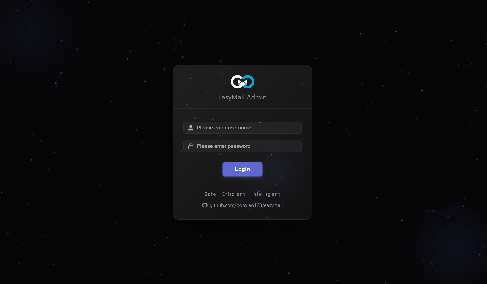
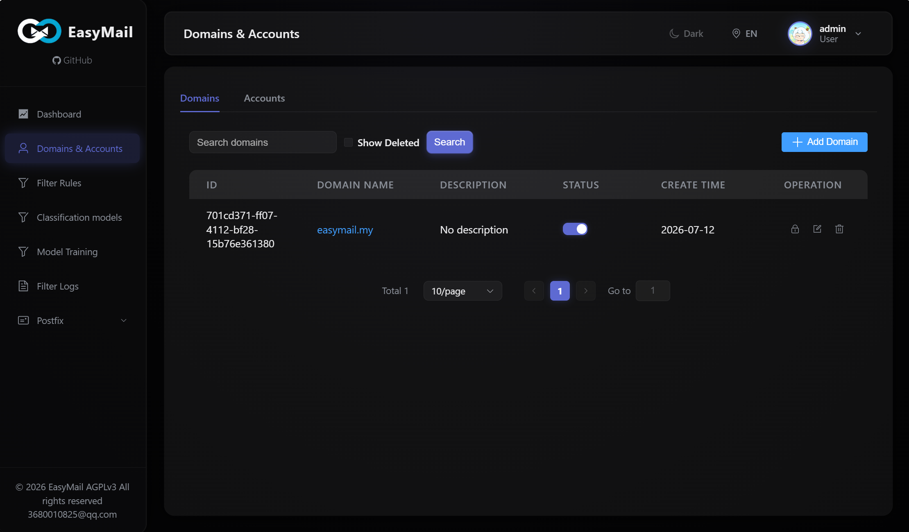
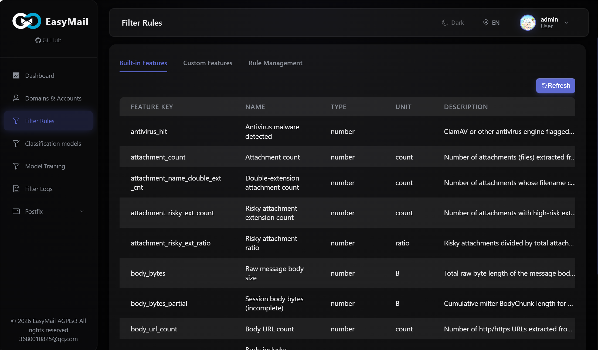
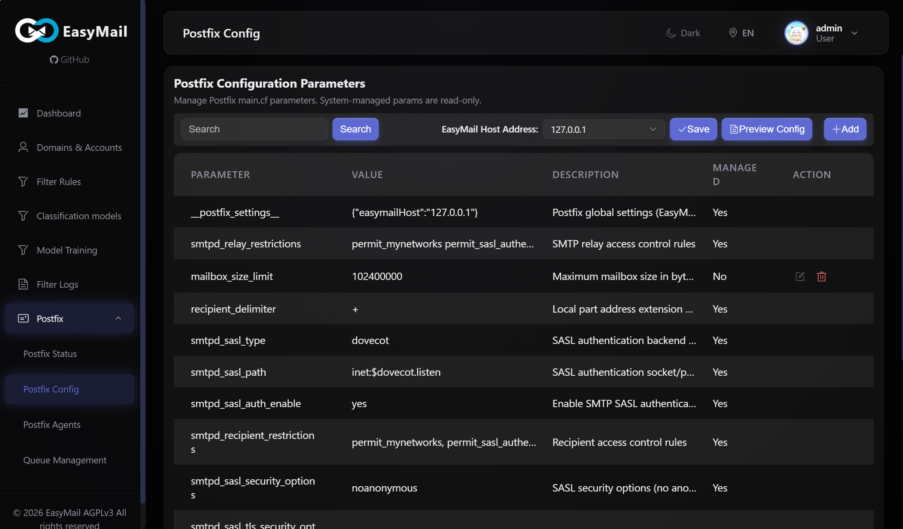
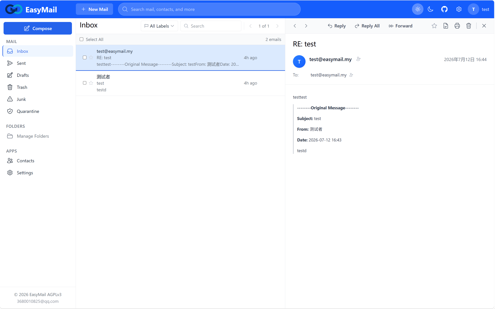
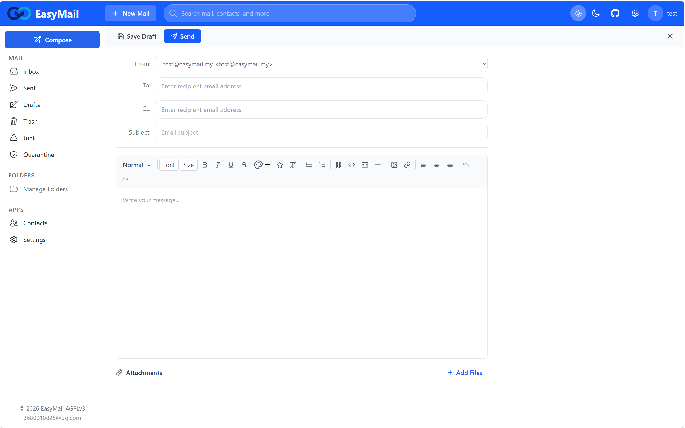
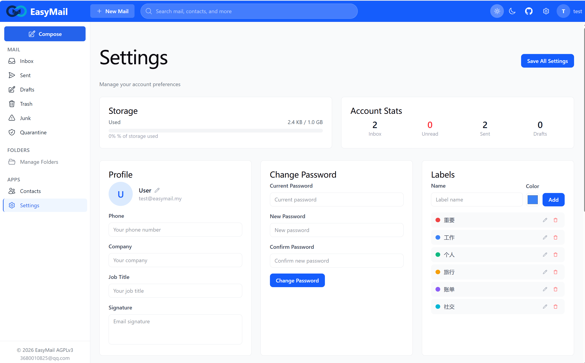
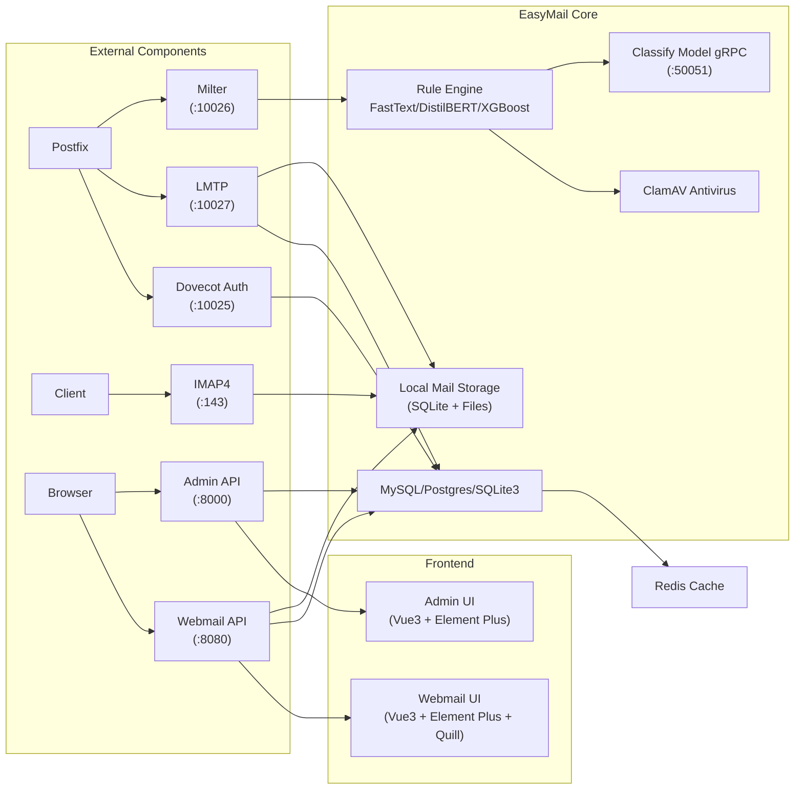

# EasyMail

[**中文**](README-cn.md) | [**English**](README.md)

**EasyMail** is an open-source, full-stack mail system built with Go and TypeScript. It integrates an SMTP gateway (Milter), mail delivery (LMTP), IMAP4 server, Dovecot authentication, Webmail, Admin Panel, and a built-in **anti-spam AI engine** supporting FastText / DistilBERT classifiers.

- **License**: AGPLv3
- **Language**: Go 1.25+ (backend), TypeScript/Vue 3 (frontend)
- **Author**: bob.xiao

---

## Features & Highlights

### Full Email Infrastructure in One Binary

EasyMail replaces the need for Dovecot (auth + IMAP), Rspamd/SpamAssassin, and custom mail admin panels. A single Go binary runs:
- **Milter** - SMTP filter gateway (Postfix integration)
- **LMTP** - Local mail delivery
- **IMAP4rev2** - RFC 9051 compliant, with IDLE support
- **Dovecot Auth Protocol** - SASL authentication
- **Admin API** - Management HTTP API
- **Webmail API** - End-user HTTP API

### Built-in AI Anti-Spam Engine

- **Multi-stage rule engine** - Evaluates at connect, HELO, MAIL FROM, RCPT TO, headers, and body stages
- **Pluggable feature extractors** - Extensible architecture for custom feature extraction
- **Multiple classifier support** - FastText, DistilBERT (ONNX), XGBoost
  - Train custom models via the Admin UI
  - Real-time inference at mail delivery time
- **ClamAV antivirus integration** - Scans attachments for malware
- **DKIM/SPF verification** - Built into the Milter pipeline
- **Real-time statistics & logging** - Dashboard with delivery logs, filter logs

### Modern Web Interfaces

| Interface | Tech Stack | Highlights |
|-----------|-----------|------------|
| **Admin Panel** | Vue 3 + Element Plus | Domain/user management, rule config, model training, Postfix management, dashboard, i18n (EN/ZH) |
| **Webmail** | Vue 3 + Element Plus + Quill | Rich text compose, contact management, folder management, labels, dark mode, i18n (EN/ZH) |

### Production-Ready Design

- **Domain-Driven Design** - Clean layered architecture (domain -> app -> infrastructure -> adapter)
- **Redis caching** - Reduces database load for user/domain lookups
- **SQLite per-mailbox** - Fast, isolated mail index storage
- **Port hardening** - Security tuning tailored for mail systems
- **Multi-language support** - Built-in i18n framework (English / Chinese)

---

## Screenshots

### Admin Panel






### Webmail






---

## Live Demo

Try EasyMail online right now:

| Panel | URL | Username | Password |
|-------|-----|----------|----------|
| **Admin Panel** | https://admin.easymail.my | `admin` | `admin888` |
| **Webmail** | https://mail.easymail.my | `test@easymail.my` | `test@123` |

---

## Quick Start (Build from Source)

### Prerequisites

- Go 1.25+
- Node.js 18+ & npm
- Make

### Build Everything

```bash
# Clone the repository
git clone https://github.com/easymail/easymail.git
cd easymail

# Build backend + frontend + release package
make all
```

This produces a `release/` directory containing:

```
release/
├── bin/easymail              # Backend binary
├── config/easymail.yaml      # Default configuration
├── frontend/admin/dist/      # Admin SPA
├── frontend/webmail/dist/    # Webmail SPA
├── scripts/                  # Deployment scripts
├── logs/                     # Runtime logs
└── storage/                  # Mail storage
```

### Platform Targets

```bash
# Linux amd64 (default)
make all

# Cross-compile for other platforms
make all GOOS=linux   GOARCH=amd64
make all GOOS=darwin  GOARCH=arm64
make all GOOS=windows GOARCH=amd64
```

### Individual Targets

```bash
make backend    # Build Go binary only
make frontend   # Build admin UI (Vue)
make webmail    # Build webmail UI (Vue)
make clean      # Remove release/
```

### Run

```bash
# Copy the release directory to the deployment location (e.g., /opt/easymail)
cp -r release/ /opt/easymail

# Switch to the deployment directory
cd /opt/easymail

# Start all services directly
./bin/easymail -config config/easymail.yaml

# Or start via the control script
./easymail.sh start
```

### systemctl with easymail

EasyMail ships with a systemd service unit at `easymail/scripts/easymail.service`.

#### Install

```bash
# 1. Deploy the release package to /opt/easymail
# 2. Create the runtime user
sudo useradd -r -s /sbin/nologin -d /opt/easymail easymail

# 3. Install the systemd unit
sudo cp easymail/scripts/easymail.service /etc/systemd/system/easymail.service

# 4. Reload systemd
sudo systemctl daemon-reload
```

#### Service Management

```bash
# Start the service
sudo systemctl start easymail

# Stop the service
sudo systemctl stop easymail

# Restart the service
sudo systemctl restart easymail

# Enable auto-start on boot
sudo systemctl enable easymail

# Check status
sudo systemctl status easymail
```

#### View Logs

```bash
# Follow live logs
sudo journalctl -u easymail -f

# View recent logs
sudo journalctl -u easymail -n 100

# View logs since last boot
sudo journalctl -u easymail -b
```

> **Note**: The default unit expects the deployment at `/opt/easymail` with the binary at `/opt/easymail/bin/easymail.sh`. Adjust paths in `easymail.service` if your deployment directory differs.

---

## Architecture



### Directory Layout

| Directory | Description |
|-----------|-------------|
| `cmd/easymail/` | Unified entry point; launches all services |
| `internal/adapter/` | Protocol adapters: IMAP, LMTP, Milter, Dovecot |
| `internal/app/` | Application services |
| `internal/domain/` | Domain models & business logic |
| `internal/infrastructure/` | Persistence, cache, DNS, migrations |
| `internal/portal/` | HTTP entrypoints: Admin & Webmail APIs |
| `internal/runtime/` | Bootstrap, config loading, service launcher |
| `internal/protocol/` | Protocol implementations (LMTP, Milter, DKIM/SPF) |
| `pkg/` | Shared utilities: JWT, i18n, logging |
| `config/` | YAML configuration files |
| `frontend/admin/` | Admin SPA (Vue 3 + Element Plus) |
| `frontend/webmail/` | Webmail SPA (Vue 3 + Element Plus + Quill) |

---

## Requirements

| Component | Required | Notes |
|-----------|----------|-------|
| Go 1.25+ | ✅ | Build toolchain |
| MySQL 8.0 / PostgreSQL / SQLite3 | ✅ | Main database |
| Redis | Optional | Caching layer |
| ONNX Runtime | Optional | DistilBERT model inference |
| FastText | Optional | Supervised training |
| ClamAV | Optional | Antivirus scanning |
| Postfix | Optional | MTA integration |

---

## Contributing

We welcome contributions of all kinds -- bug fixes, new features, documentation improvements, and more.

1. Fork the repository
2. Create a feature branch (`git checkout -b feature/amazing-feature`)
3. Commit your changes (`git commit -m 'Add amazing feature'`)
4. Push to the branch (`git push origin feature/amazing-feature`)
5. Open a Pull Request

**Join our development team!** If you are interested in long-term involvement, reach out to us.

---

## Donate

If EasyMail is useful to you or your business, consider supporting the project:

- **Contact**: 3680010825@qq.com
- Your support helps cover infrastructure costs, domain names, and development time.

---

## Contact

- **Author Email**: 3680010825@qq.com
- **Live Demo**: https://admin.easymail.my / https://mail.easymail.my

---

## License

This project is licensed under the **GNU Affero General Public License v3 (AGPLv3)**.

For commercial licensing inquiries, please contact: **3680010825@qq.com**