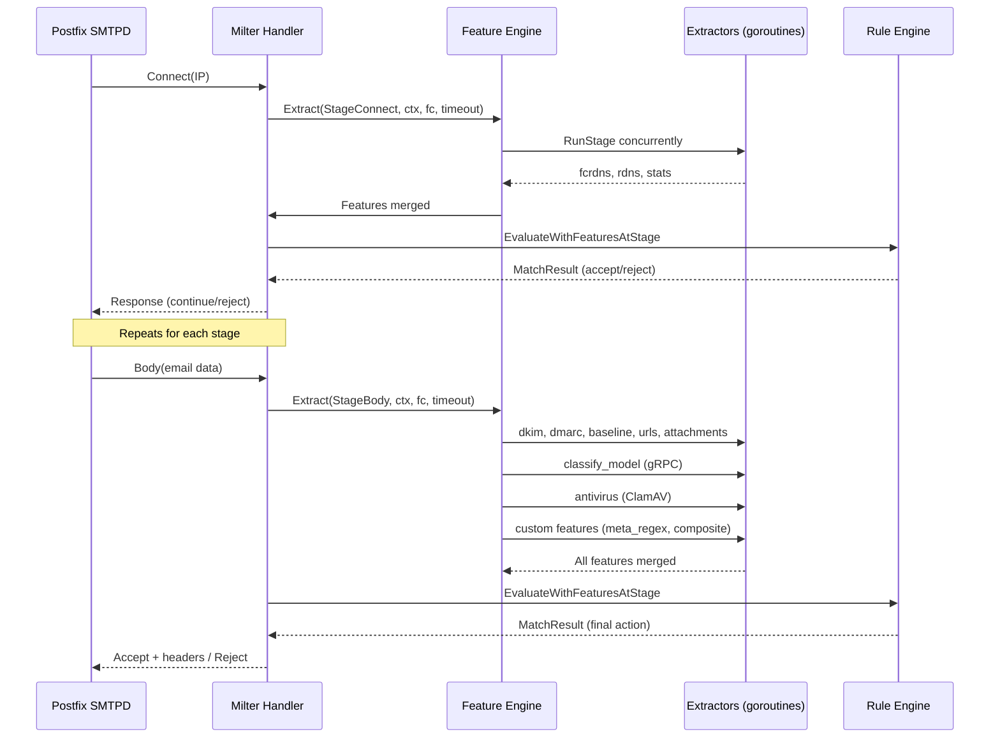

# EasyMail Anti-Spam Technology

EasyMail integrates a multi-layered anti-spam system operating at the SMTP Milter (Milter protocol) level. It combines real-time feature extraction, a JSON-based rule engine, custom/regex/composite features, ML classifier models (FastText in-process, DistilBERT via gRPC), and antivirus scanning (ClamAV) to classify and act on inbound emails before they reach the user's mailbox.

---

## 1. Built-in Features

Features are numeric values extracted at each stage of the SMTP transaction. They serve as the input signals for rule evaluation. Extractors run concurrently within a configurable timeout budget.

### 1.1 Extraction Pipeline

The mail flow is divided into six Milter stages. Extractors register themselves to one or more stages and are invoked when the corresponding SMTP event occurs.

```
Connect -> Helo -> MailFrom -> RcptTo -> Headers -> Body
```

### 1.2 Stage Connect

| Extractor Key | Features | Description |
|---|---|---|
| `connect_rdns` | `ip_ptr_ok`, `ip_ptr_count`, `ip_ptr_has_dot` | Reverse DNS lookup for the connecting IP. Checks whether a PTR record exists, its count, and whether it contains a dot (fully qualified). |
| `connect_fcrdns` | `ip_fcrdns_ok`, `ip_ptr_forward_match_count` | Forward-confirmed rDNS: performs PTR lookup, then verifies at least one forward (A/AAAA) record for the returned hostname matches the original connecting IP. |
| `stats_connect` | `ip_conn_5m`, `ip_conn_1d`, `ip_accept_5m`, `ip_reject_5m`, `ip_spam_5m`, `ip_accept_1d`, `ip_reject_1d`, `ip_spam_1d` | Redis-backed connection rate and historical outcome counters per connecting IP (5-minute sliding window and daily calendar window). |

### 1.3 Stage Helo

| Extractor Key | Features | Description |
|---|---|---|
| `helo_rdns_match` | `helo_present`, `helo_rdns_match`, `helo_rdns_name_count` | Compares the HELO/EHLO hostname against the connecting IP's PTR record(s). Covers exact match, subdomain match, and domain suffix match. |

### 1.4 Stage MailFrom

| Extractor Key | Features | Description |
|---|---|---|
| `spf` | `spf_result`, `spf_pass`, `spf_fail`, `spf_softfail`, `spf_neutral`, `spf_none`, `spf_error`, `spf_skipped` | SPF (Sender Policy Framework) check per RFC 7208. Uses the `blitiri.com.ar/go/spf` library. Looks up the SPF TXT record for the sender's domain, evaluates the connecting IP against the advertised policy. Seven result codes: None (0), Neutral (1), Pass (2), SoftFail (3), Fail (4), TempError (5), PermError (6). |
| `mailfrom_domain_dns` | `sender_domain_has_mx`, `sender_domain_has_a`, `sender_domain_mx_count`, `sender_domain_mx_pref_min`, `sender_domain_mx_is_null`, `sender_domain_a_count` | DNS health checks for the sender's domain. Verifies the domain has MX and/or A records, counts them, and detects null MX (`.`) which indicates the domain does not accept mail. |
| `stats_mailfrom` | `sender_conn_5m`, `sender_conn_1d`, `sender_accept_5m`, `sender_reject_5m`, `sender_spam_5m`, `sender_accept_1d`, `sender_reject_1d`, `sender_spam_1d` | Per-sender (envelope MAIL FROM) rate and outcome counters via Redis. |

### 1.5 Stage RcptTo

| Extractor Key | Features | Description |
|---|---|---|
| `rcpt_local` | `rcpt_domain_is_local`, `rcpt_mailbox_exists` | Checks whether the recipient domain is a local/configured domain and whether the mailbox exists. DB-dependent checks are delegated to the app layer. |
| `rcpt_contact_hit` | `rcpt_contact_sender_hit` | Checks whether the sender is in the recipient's address book. DB-dependent. |
| `stats_rcpt` | per-recipient counters | Redis-backed per-recipient rate counters. |
| `stats_rcpt_domain` | per-domain counters | Redis-backed per-recipient-domain rate counters. |

### 1.6 Stage Headers

| Extractor Key | Features | Description |
|---|---|---|
| (inline in `Header()` callback) | `header_received`, `header_dkim_signature`, `header_authentication_results`, `header_content_type_multipart`, `header_has_message_id`, `header_has_date`, `header_list_id`, `header_list_unsubscribe`, `header_custom_count`, `header_fields` | Lightweight header tracking without MIME parsing. Counts Received headers, detects DKIM-Signature presence, Content-Type multipart, List-* headers, and custom X-* header count. |

### 1.7 Stage Body

| Extractor Key | Features | Description |
|---|---|---|
| `message_baseline` | `body_bytes`, `subject_len`, `has_list_unsubscribe`, `mime_part_count`, `attachment_count`, `rcpt_count` | Structural message analysis via `enmime`. Parses the full email, counts MIME parts and attachments. Falls back to header-only analysis when enmime parsing fails. |
| `dkim` | `dkim_result`, `dkim_pass`, `dkim_fail`, `dkim_sig_count`, `dkim_pass_count`, `dkim_fail_count`, `dkim_verified_count`, `dkim_skipped` | DKIM (DomainKeys Identified Mail) signature verification per RFC 6376. Parses DKIM-Signature headers, looks up the selector's public key via `_domainkey.<domain>` DNS TXT records, verifies body hash and header signature using RSA/SHA-256. Supports multiple DKIM signatures per message. |
| `dmarc` | `dmarc_result`, `dmarc_pass`, `dmarc_fail`, `dmarc_has_policy`, `dmarc_policy_none`, `dmarc_policy_quarantine`, `dmarc_policy_reject`, `dmarc_policy_code`, `dmarc_spf_aligned`, `dmarc_dkim_aligned`, `dmarc_spf_domain_match`, `dmarc_dkim_domain_match` | DMARC (Domain-based Message Authentication, Reporting, and Conformance) policy evaluation per RFC 7489. Looks up `_dmarc.<domain>` TXT record, parses the policy (`p=`), checks SPF alignment (MAIL FROM domain vs From header domain) and DKIM alignment (`d=` domain vs From domain) using relaxed (organizational domain via Public Suffix List) mode. |
| `classify_model` | model-specific features (e.g. `my_model`, `my_model_spam`, `my_model_ham`) | ML classifier model inference. Supports FastText (in-process), DistilBERT and other ONNX models (via gRPC worker). Features are sanitized as `modelName_label`. Details in section 4. |
| `antivirus` | `antivirus_hit` | ClamAV scanning. `1.0` if a virus is detected, `0.0` if clean, `-1.0` on error. |

#### Content Plugins (Body Stage)

| Plugin Key | Features | Description |
|---|---|---|
| `url_basic` | `body_url_count`, `body_url_has_http`, `body_url_has_https`, `body_url_short_count`, `body_url_has_short` | URL extraction and classification. Scans the email body for HTTP/HTTPS URLs, counts them, detects short URLs (services like t.co, bit.ly) based on URL shape analysis (short host + compact slug). |
| `attachment_risk` | `attachment_count`, `attachment_risky_count`, `attachment_double_ext_count`, `attachment_has_risky`, `attachment_has_double_ext` | Attachment risk assessment. Identifies executable/script file extensions (`.exe`, `.dll`, `.scr`, `.bat`, `.ps1`, `.vbs`, `.js`, `.jar`, `.lnk`, `.iso`, `.hta`, `.msi`, `.reg`, `.wsf`). Detects double-extension patterns (e.g. `invoice.pdf.exe`). |

### 1.8 DNS Infrastructure

Feature extractors use a shared DNS resolver (`easymail/internal/infrastructure/easydns`) that supports:

- Custom DNS server configuration
- Lookup methods: LookupAddr (PTR), LookupMX, LookupIPAddr (A/AAAA), LookupTXT
- Context-based timeouts for all lookups
- Fallback to system-configured DNS when custom servers are not specified

---

## 2. Custom Features

In addition to built-in extractors, administrators can define custom features through the admin Web UI. These are stored in the `custom_features` database table (not in YAML configuration) and are evaluated alongside built-in features during each pipeline stage.

### 2.1 Custom Feature Schema

| Field | Description |
|---|---|
| `id` | Auto-increment primary key |
| `feature_key` | Unique key name for the feature |
| `label` | Human-readable display name |
| `stage` | Which pipeline stage this feature targets |
| `type` | `meta_regex` or `composite` |
| `value_type` | Data type of the output value |
| `enabled` | Whether this custom feature is active |
| `spec_json` | JSON specification (varies by type) |
| `description` | Human-readable description |
| `unit` | Measurement unit |

### 2.2 Meta Regex Features (`meta_regex`)

Scans specific parts of the email message or session metadata using a regular expression and emits boolean or count features.

#### Spec Fields

| Field | Description |
|---|---|
| `sources` | Array of source strings to scan. Supported sources: `connect_ip`, `mail_from`, `rcpt`, `subject`, `header_from_email`, `header_from_name`, `body`, `url_list`, `attachment_names` |
| `pattern` | Regular expression pattern |
| `flags` | Regex flags: `i` (case-insensitive), `m` (multiline), `s` (dot-all) |
| `mode` | `any` (true if at least one source matches) or `all` (true only if every source matches) |
| `emit` | `bool_hit` (emit 0/1) or `count` (emit match count) |

#### Source Availability by Stage

| Source | Earliest Stage | Content |
|---|---|---|
| `connect_ip` | Connect | Connecting IP address string |
| `mail_from` | MailFrom | Envelope MAIL FROM |
| `rcpt` | RcptTo | First envelope RCPT TO |
| `subject` | Headers | Decoded subject line (RFC 2047) |
| `header_from_email` | Headers | From header email address (parsed) |
| `header_from_name` | Headers | From header display name (parsed) |
| `body` | Body | Full email body text (truncated at 1 MiB) |
| `url_list` | Body | URLs extracted from email body |
| `attachment_names` | Body | Attachment filenames from MIME parsing |

#### Example: Detect phishing subject patterns

```json
{
  "sources": ["subject"],
  "pattern": "(?i)(urgent|account.*suspend|verify.*identity|security.*alert)",
  "flags": "",
  "mode": "any",
  "emit": "bool_hit"
}
```

This produces the feature `phishing_subject_hit` with value `1.0` if the subject matches any of the patterns, `0.0` otherwise.

#### Example: Count suspicious URLs

```json
{
  "sources": ["url_list"],
  "pattern": "(?i)(bit\\.ly|tinyurl\\.com|short\\.link)",
  "flags": "",
  "mode": "all",
  "emit": "count"
}
```

This produces a count of shortened URLs found in the email body.

### 2.3 Composite Features (`composite`)

Combines multiple existing features (both built-in and other custom features) using the same condition AST as the rule engine, producing a boolean result.

#### Spec Fields

| Field | Description |
|---|---|
| `condition_json` | A JSON condition tree (same AST format as rules) |
| `emit` | Always `"bool"` |

#### Example: High-risk sender with suspicious content

```json
{
  "condition_json": {
    "op": "and",
    "children": [
      { "op": "feat", "feature": "ip_fcrdns_ok" },
      { "op": "cmp", "feature": "body_url_count", "kind": "gt", "value": 5 },
      { "op": "cmp", "feature": "spf_result", "kind": "ne", "value": 2 }
    ]
  },
  "emit": "bool"
}
```

Composite features can reference other composite features, enabling cascaded/chain evaluation. The system uses iterative fixed-point computation to resolve transitive dependencies across composite features.

### 2.4 Custom Feature Lifecycle

1. **Creation**: Defined via admin UI → stored in `custom_features` table
2. **Compilation**: At runtime, features are loaded from DB and compiled:
   - `meta_regex`: pattern is compiled into `regexp.Regexp`
   - `composite`: condition JSON is validated
3. **Stage Assignment**: The system automatically determines the earliest pipeline stage needed based on source dependencies (for meta_regex) and referenced feature stages (for composite)
4. **Evaluation**: During each pipeline stage, `applyCustomFeaturesForStage()` runs:
   - First pass: after built-in extractors complete
   - Second pass (Body stage only): after content plugins finish
5. **Cache Invalidation**: DB results are cached with a 10-second TTL; admin CUD operations call `InvalidateCustomFeatureDefsCache()` to clear the cache immediately

---

## 3. Rule System

Rules define the anti-spam policy. Each rule has a JSON condition tree, a target stage, an action, a priority, and an enable/disable flag. Rules are cached in memory and evaluated per stage.

### 3.1 Rule Schema

```json
{
  "id": 1,
  "name": "Reject missing SPF",
  "enabled": true,
  "priority": 100,
  "stage": "mailfrom",
  "action": "reject",
  "conditionJson": "{...}"
}
```

| Field | Description |
|---|---|
| `id` | Auto-increment primary key |
| `name` | Human-readable rule name |
| `enabled` | Whether the rule is active |
| `priority` | Higher-priority rules are evaluated first |
| `stage` | Which pipeline stage this rule applies to (optional; auto-derived from condition features when absent) |
| `action` | One of: `accept`, `reject`, `spam`, `quarantine` |
| `conditionJson` | JSON AST for the condition |

### 3.2 Condition AST

Conditions are expressed as a JSON tree with the following node types.

#### Logical Operators

| Operator | Description | Children |
|---|---|---|
| `and` | All children must be true | 2+ |
| `or` | At least one child must be true | 2+ |
| `not` | Negates the single child | 1 |

#### Feature Operators

| Operator | Description | Fields |
|---|---|---|
| `feat` | True if the feature exists and its value is non-zero | `feature`: feature key name |
| `cmp` | Compares a feature value against a threshold | `feature`: feature key, `kind`: comparison type, `value`: numeric threshold |

#### cmp Kinds

| Kind | Meaning |
|---|---|
| `eq` | Equal (`==`) |
| `ne` | Not equal (`!=`) |
| `gt` | Greater than (`>`) |
| `ge` | Greater than or equal (`>=`) |
| `lt` | Less than (`<`) |
| `le` | Less than or equal (`<=`) |

### 3.3 Example Conditions

**SPF fail with DMARC reject policy:**

```json
{
  "op": "and",
  "children": [
    { "op": "cmp", "feature": "spf_result", "kind": "eq", "value": 4 },
    { "op": "cmp", "feature": "dmarc_policy_code", "kind": "eq", "value": 2 }
  ]
}
```

**High connection rate from IP with no FCrDNS:**

```json
{
  "op": "and",
  "children": [
    { "op": "cmp", "feature": "ip_conn_5m", "kind": "gt", "value": 100 },
    { "op": "not", "children": [{ "op": "feat", "feature": "ip_fcrdns_ok" }] }
  ]
}
```

**High spam score from classifier with suspicious attachment:**

```json
{
  "op": "and",
  "children": [
    { "op": "cmp", "feature": "my_model_spam", "kind": "gt", "value": 0.8 },
    { "op": "feat", "feature": "attachment_has_risky" }
  ]
}
```

**Multiple conditions joined with OR:**

```json
{
  "op": "or",
  "children": [
    {
      "op": "and",
      "children": [
        { "op": "cmp", "feature": "spf_result", "kind": "eq", "value": 4 },
        { "op": "cmp", "feature": "dmarc_policy_code", "kind": "eq", "value": 2 }
      ]
    },
    {
      "op": "cmp", "feature": "antivirus_hit", "kind": "eq", "value": 1
    }
  ]
}
```

### 3.4 Rule Evaluation Flow

```
For each pipeline stage S:
  1. Load all enabled rules (cached, refresh on DB change)
  2. Filter: only rules matching stage S (or auto-derived stage matches)
  3. Sort by priority descending (higher number = evaluated first)
  4. For each rule in sorted order:
     a. Deserialize conditionJson into AST (CondNode tree)
     b. Evaluate the tree against the current feature snapshot
     c. If condition matches → apply action, store match result, break
  5. If no rule matched → apply default_action (configurable, default: accept)
```

Key behaviors:
- **Priority ordering**: Rules with higher `priority` values are evaluated first. When priorities are equal, order is undefined (use unique priorities to be deterministic).
- **Early termination**: The first matching rule wins. Subsequent rules are not evaluated.
- **Stage filtering**: A rule only evaluates at the stage it belongs to. The system can auto-derive a rule's stage from the features referenced in its condition, or the admin can explicitly set it.
- **Feature snapshot**: At each stage, the current feature snapshot contains all features extracted so far in this and all prior stages, plus any custom features already evaluated.

### 3.5 Actions

| Action | Milter Response | LMTP Routing |
|---|---|---|
| `accept` | `SMFIR_CONTINUE` (allow) | Deliver to Inbox |
| `reject` | `SMFIR_REPLYCODE` (5xx SMTP reject) | Not delivered (unless bypassed) |
| `spam` | `SMFIR_CONTINUE` (allow) | Route to Spam folder |
| `quarantine` | `SMFIR_CONTINUE` (allow) | Route to Quarantine folder |

### 3.6 Generating Rules from Features

When defining rules in the admin UI, all available features are listed with their metadata:

| Metadata Field | Description |
|---|---|
| `featureKey` | Feature identifier for use in condition JSON |
| `origin` | `builtin`, `custom`, or `model` |
| `builtinExtractor` | Extractor name (for builtin features) |
| `customFeatureId` | Custom feature ID (for custom features) |
| `modelId` / `modelName` | Model reference (for model features) |

The admin UI provides a condition builder that constructs the JSON AST from interactive form controls, allowing administrators to compose complex conditions without writing raw JSON.

### 3.7 Filter Logs

Each milter session generates a filter log entry accessible through the admin dashboard. A log entry contains:

| Field | Description |
|---|---|
| `trace_id` | Unique trace identifier for the session |
| `queue_id` | Postfix queue ID |
| `connect_ip` | Connecting IP address |
| `sender` | Envelope MAIL FROM |
| `recipient` | Envelope RCPT TO |
| `subject` | Decoded subject |
| `stage` | Pipeline stage where the match occurred |
| `rule_id` | ID of the matching rule (0 for default action) |
| `action` | Action applied (accept/reject/spam/quarantine) |
| `feature_snapshot` | Full JSON snapshot of all extracted features (when `log_feature_snapshot` is enabled) |
| `condition_trace` | Condition evaluation trace — which features were evaluated and whether each sub-condition matched (when `log_condition_trace` is enabled) |
| `duration_ms` | Total processing duration for the session |

The condition trace is a structured log showing the evaluation path through the condition tree. For example, for an `and` node with two children, the trace records both whether the parent matched and whether each child matched, making it possible to debug why a rule fired or why it didn't.

---

## 4. FastText Model Online Training

EasyMail provides a complete online training workflow for FastText classification models, including sample management, model training, model publishing, and rule integration.

### 4.1 Architecture Overview

```
Admin UI                    Milter Runtime
    |                            |
    v                            v
+-------------------+    +-------------------+
| Sample Management |    |   Model Cache     |
| (model_samples)   |    | (on demand open)  |
+--------+----------+    +--------+----------+
         |                        |
         v                        v
+-------------------+    +-------------------+
| Training Engine   |    | Feature Extractor |
| (fasttext CLI)    |    | (classify_model)  |
+--------+----------+    +--------+----------+
         |                        |
         v                        v
+-------------------+    +-------------------+
| Model Files (.bin)|    |   Rule Engine     |
| (on disk storage) |    | (condition eval)  |
+-------------------+    +-------------------+
```

### 4.2 Database Tables

#### classify_models — Model Definition

| Column | Type | Description |
|---|---|---|
| `id` | uint (PK) | Auto-increment |
| `name` | varchar(255) | Display name (also the feature key root) |
| `algorithm` | varchar(50) | `FastText`, `DistilBERT`, or `XGBoost` |
| `tokenizer` | varchar(50) | `GSE`, `WordPiece`, or `distilbert-base-cased` |
| `languages` | longtext | JSON array, e.g. `["en","zh"]` |
| `save_path` | varchar(500) | Model file path (set after training) |
| `params` | longtext | JSON — `ModelParams`: lr, epoch, wordNgrams, dim, loss |
| `max_text_length` | int (default: 256) | Input truncation length |
| `email_fields` | longtext | JSON array — which fields to extract text from |
| `class_labels` | longtext | JSON string array — synced from samples after training |
| `enabled` | bool (default: false) | Whether to run this model at runtime |
| `train_status` | varchar(50) | `pending`, `running`, `completed`, `failed` |
| `train_result` | text | Training log output |
| `train_time` | datetime | Training completion time |
| `is_deleted` | bool | Soft delete flag |

#### model_samples — Training Samples per Model

| Column | Type | Description |
|---|---|---|
| `id` | uint (PK) | Auto-increment |
| `classify_model_id` | uint (FK) | References `classify_models.id` |
| `text` | text | Training text content |
| `label` | varchar(255) | Gold label for the sample |
| `created_at` / `updated_at` | datetime | Timestamps |

#### public_samples — Public Sample Library

| Column | Type | Description |
|---|---|---|
| `id` | uint (PK) | Auto-increment |
| `category_id` | uint (FK) | References `public_sample_categories.id` |
| `tag` | varchar(255) | Classification tag (e.g. `spam`, `phishing`) |
| `text` | text | Example text content |
| `created_at` / `updated_at` | datetime | Timestamps |

#### public_sample_categories — Public Sample Categories

| Column | Type | Description |
|---|---|---|
| `id` | uint (PK) | Auto-increment |
| `name` | varchar(128) | Unique category name |
| `description` | varchar(500) | Category description |
| `sample_count` | bigint | Approximate sample count |
| `created_at` / `updated_at` | datetime | Timestamps |

#### training_tasks — Ad-hoc Training Job Records

| Column | Type | Description |
|---|---|---|
| `id` | uint (PK) | Auto-increment |
| `model_name` | varchar(255) | Generated model name |
| `algorithm` | varchar(50) | Always `FastText` |
| `params` | longtext | JSON hyperparameters |
| `sample_mappings` | longtext | JSON mapping: TargetClass → source groups |
| `status` | varchar(50) | `pending`, `running`, `completed`, `failed` |
| `train_result` | longtext | Log output |
| `model_id` | uint | Generated `classify_models.id` |
| `created_at` / `updated_at` | datetime | Timestamps |

### 4.3 API Endpoints

All endpoints are under `/api/v1/admin/` and require JWT authentication.

#### Model CRUD (`/api/v1/admin/classify-models`)

| Method | Route | Description |
|---|---|---|
| GET | /classify-models | List models (supports `?keyword`, `?algorithm`, `?status`, `?page`, `?pageSize`) |
| GET | /classify-models/:id | Get model by ID |
| POST | /classify-models | Create model (JSON for FastText, multipart for DistilBERT with ONNX upload) |
| PUT | /classify-models/:id | Update model fields |
| DELETE | /classify-models/:id | Soft delete model + remove samples + remove model file |
| POST | /classify-models/:id/train | **Start FastText training** (asynchronous) |
| POST | /classify-models/:id/predict | Run one-shot inference for testing |
| POST | /classify-models/import | Import model from zip |
| GET | /classify-models/:id/export | Export model as zip |

#### Per-Model Samples (`/classify-models/:id/samples`)

| Method | Route | Description |
|---|---|---|
| GET | /:id/samples | List samples (`?keyword`, `?label`, `?page`) |
| POST | /:id/samples | Create single or batch samples (`items` array) |
| GET | /:id/samples/labels | List unique labels for this model |
| GET | /:id/samples/export | Download train.txt (`__label__<class>\t<text>`) |
| PUT | /:id/samples/:sampleId | Update sample |
| DELETE | /:id/samples/:sampleId | Delete sample |

#### Ad-hoc Training (`/api/v1/admin/training`)

| Method | Route | Description |
|---|---|---|
| POST | /training | **Start ad-hoc training** from public sample mappings |
| GET | /training/:id | Get training task status + logs |

#### Public Samples (`/api/v1/admin/samples`)

| Method | Route | Description |
|---|---|---|
| GET | /samples | List samples (`?categoryId`, `?tag`, `?keyword`) |
| GET | /samples/tags | List unique tags |
| GET | /samples/stats | Counts by category + tag |
| POST | /samples | Create single or batch samples |
| POST | /samples/batch-delete | Batch delete |
| POST | /samples/batch-update | Batch update tags/categories |
| PUT | /samples/:id | Update sample |
| DELETE | /samples/:id | Delete sample |
| GET | /sample-categories | List categories |
| POST | /sample-categories | Create category |

### 4.4 Training Workflow A: Model-bound Training

This workflow manages a specific model's samples and trains directly from them.

```
Step 1: Create model definition
  POST /classify-models
    { name, algorithm: "FastText", tokenizer, languages,
      params: { lr, epoch, wordNgrams, dim, loss },
      email_fields, max_text_length }
  → Model created with enabled=false, train_status=pending

Step 2: Import samples
  POST /classify-models/:id/samples [{ text, label }, ...]
  → Stored in model_samples table

Step 3: Start training
  POST /classify-models/:id/train
  → Validates: fasttext executable configured, model_root configured,
                at least 1 sample, no concurrent training running
  → Sets train_status=running, spawns goroutine:

    a. Read all samples from DB
    b. Write train.txt: one line per sample
       Format: "__label__<class> <tokenized_text>"
    c. Execute:
       fasttext supervised -input train.txt -output model \
         [-lr N] [-epoch N] [-wordNgrams N] [-dim N] [-loss softmax|hs|ns|ova]
    d. Stream stdout/stderr, update train_result in DB
    e. On success:
       - Copy model binary to model_root/<sanitized_name>/model.bin
       - Set save_path, train_status=completed, train_time=now
       - Sync class_labels from distinct sample labels
       - Invalidate model cache
    f. On failure:
       - Set train_status=failed, store error in train_result

Step 4: Publish model
  PUT /classify-models/:id { enabled: true }
  → Validates that model file exists at save_path
  → Runtime cache picks up enabled model within 60 seconds
  → Next email scan: ModelCache opens the FastText predictor on demand
```

### 4.5 Training Workflow B: Ad-hoc Training from Public Samples

This workflow allows administrators to quickly create models using the public sample library with label mapping.

```
Step 1: Prepare public samples
  Import samples via /samples API into public_samples table
  Organize into categories (public_sample_categories)

Step 2: Configure training
  POST /training
    { modelName, algorithm: "FastText",
      params: { learningRate, epoch, wordNgrams, dim, loss },
      sampleMappings: [{
        targetClass: "spam",
        sources: [{
          category: "General",
          tags: ["spam", "phishing"],
          limitType: "random",
          limitN: 5000
        }]
      }, {
        targetClass: "ham",
        sources: [{
          category: "General",
          tags: ["ham"],
          limitType: "random",
          limitN: 5000
        }]
      }]
    }

Step 3: Training runs
  a. Create TrainingTaskPO record
  b. For each TargetClass → source mapping:
     - Query public_samples by category_id + tags
     - Apply limit policy (random/first/last/middle) for balanced datasets
     - Build training lines: "__label__<class> <text>"
  c. Create a new ClassifyModelPO (enabled=false, train_status=running)
  d. Write train.txt, exec fasttext supervised, stream logs
  e. On success: set save_path, train_status=completed
  f. On failure: soft-delete generated model, set train_status=failed

Step 4: Publish (same as Workflow A)
  Enable the model → runtime picks it up → rule conditions can reference it
```

### 4.6 Model Inference at Runtime

When a mail arrives at the Body stage, the classify_model extractor runs:

1. **Assembly**: Extract text from the email based on `email_fields` configuration (subject, plain body, sender name, etc.)
2. **Truncation**: Truncate to `max_text_length` (default: 8192 runes)
3. **Model Cache**: `ModelCache.PredictAll()` iterates over all enabled, non-deleted models:
   - **FastText models**: In-process inference using the pure-Go FastText engine (no external process, no C++ dependency). Loads the `.bin` model file and runs prediction.
   - **Non-FastText models** (DistilBERT, XGBoost): Sent via gRPC to the classifier worker process.
4. **Feature Output**: Each model's prediction produces a set of features:
   - If model has `class_labels` (e.g. `["spam", "ham"]`): `modelname_spam` and `modelname_ham` with probability scores
   - If no class labels: `modelname` with the top probability value
5. **Merge**: Features are merged into the MilterContext feature snapshot
6. **Rule Evaluation**: Rules referencing these features (e.g. `my_model_spam > 0.8`) are evaluated against the snapshot

### 4.7 Model References in Rules

Models are referenced in rules through their sanitized feature keys:

```
Model Name: "My Spam Detector"
Sanitized:  "my_spam_detector"
Features:   "my_spam_detector_spam" (score for "spam" label)
            "my_spam_detector_ham"  (score for "ham" label)
```

The sanitization process (`SanitizeFeatureKey`) converts the model name to lowercase and replaces non-`[a-z0-9]` characters with underscores.

Rules can then use these features in conditions:

```json
{
  "op": "cmp",
  "feature": "my_spam_detector_spam",
  "kind": "gt",
  "value": 0.85
}
```

The admin rule editor lists all available model features with their source metadata (ModelID, ModelName, FeatureOrigin: `model`), making it easy to build conditions that incorporate ML model outputs.

### 4.8 Model Export and Import

Models can be exported as a zip file containing:
- `model.bin` — The FastText model binary
- `model.conf` — JSON configuration (name, algorithm, params, class_labels, email_fields, etc.)

Import restores both the binary and the model configuration, creating a new `classify_models` record.

---

## 5. Filter Pipeline

The anti-spam filter operates as a Postfix Milter (Milter protocol). Postfix is configured to delegate each incoming message to EasyMail's milter endpoint. The pipeline processes messages through a series of stages with concurrent feature extraction, rule evaluation, and optional ancillary services.

### 5.1 Architecture Overview

```
Postfix SMTPD
    |
    v  (Milter protocol over TCP)
EasyMail Milter Server
    |
    +---> Stage Connect:    rDNS, fcDNS, IP stats
    +---> Stage Helo:       HELO/rDNS matching
    +---> Stage MailFrom:   SPF check, domain DNS health, sender stats
    +---> Stage RcptTo:     local check, contact lookup, recipient stats
    +---> Stage Headers:    header tracking
    +---> Stage Body:       DKIM, DMARC, baseline, URLs, attachments,
    |                       antivirus (ClamAV), ML model(s),
    |                       custom features (meta_regex + composite)
    |
    +---> Rule evaluation per stage (cached rules + all features)
    |
    +---> Outcome:
            accept  -> SMFIR_CONTINUE (mail delivered)
            reject  -> SMFIR_REPLYCODE (5xx SMTP rejection)
            spam    -> SMFIR_CONTINUE + X-EasyMail headers -> Spam folder
            quarantine -> SMFIR_CONTINUE -> Quarantine folder
```

### 5.2 Stage Timeout Management

Each milter stage has a configurable timeout (default per-stage values with a global override `stage_timeout_ms`). The timeout budget is split:
- Half for concurrent feature extraction (built-in extractors)
- Half for custom features and content plugins

When a stage times out, already-received features are still merged into the context. This ensures the filter degrades gracefully under load.

### 5.3 Concurrent Execution

Within each stage, registered extractors run concurrently as goroutines. A timeout channel collects results; extractors exceeding the timeout are abandoned (their partial or absent features are skipped).



### 5.4 Antivirus Scanning (ClamAV)

When ClamAV is enabled and configured, the Body stage scans:
- The complete email body (when `scan_body` is true)
- Each attachment individually (when `scan_attachments` is true)

The scan results produce the `antivirus_hit` feature:
- `1.0` if a virus is detected
- `0.0` if all scans are clean
- `-1.0` if the scan encountered an error

### 5.5 Redis Statistics Tracking

The filter uses Redis to track:
- **Connection rates** per IP (5-minute sliding window and daily)
- **Outcome histories** per IP, per sender, and per recipient domain
- **Intraday filter outcomes** for dashboard reporting

These counters feed into feature extraction (e.g., `ip_conn_5m`, `sender_reject_1d`) and also power the admin dashboard statistics.

### 5.6 SMTP Rejection

When the filter action is `reject`, the milter sends a custom SMTP reply (SMFIR_REPLYCODE). The reply code, enhanced code, and message are configurable:

```yaml
filter:
  rules:
    reject_reply:
      smtp_code: "550"
      enhanced_code: "5.7.1"
      message: "Spam detected by EasyMail"
```

### 5.7 Headers Injected by Milter

After Body-stage processing, the milter injects these headers into the message before it reaches LMTP delivery:

| Header | Value |
|---|---|
| `X-EasyMail-Filter-Action` | The final action: `accept`, `spam`, `quarantine`, or `reject` |
| `X-EasyMail-Filter-Rule-Id` | ID of the matching rule (0 for default action) |
| `X-EasyMail-Filter-Trace-Id` | Unique trace identifier for debugging |

These headers are stripped by the milter from inbound messages at the Headers stage (via `SMFIR_CHGHDRS`) to prevent forgery.

### 5.8 LMTP Routing

The LMTP delivery service reads the `X-EasyMail-Filter-Action` header to determine the target folder:

| Header Value | Routed Folder |
|---|---|
| `accept` | Inbox |
| `spam` | Spam |
| `quarantine` | Quarantine |
| `reject` | Default (Inbox; reject should have been enforced at milter) |
| (absent) | Inbox |

### 5.9 Configuration Reference

Key configuration options for the filter (under `milter.filter` in `easymail.yaml`):

```yaml
milter:
  filter:
    enable: true                          # Master switch
    rules:
      default_action: accept              # Default policy when no rule matches
      log_feature_snapshot: true          # Log all extracted features
      log_condition_trace: true           # Log condition evaluation trace
      skip_for_compose_delivery: true     # Skip filtering for locally composed mails
      stage_timeout_ms: 5000              # Per-stage timeout (milliseconds)
      reject_reply:
        smtp_code: "550"                  # SMTP reply code on reject
        enhanced_code: "5.7.1"            # Enhanced status code
        message: "Spam detected by EasyMail"
    classify_model:
      enable: true                        # Enable ML model inference
      endpoint: "127.0.0.1:50051"         # gRPC classifier worker (for DistilBERT)
      infer_deadline_ms: 0                # Deadline for model inference (0 = use stage_timeout_ms)
    clamav:
      enable: true                        # Enable ClamAV scanning
      addr: "127.0.0.1:3310"              # ClamAV daemon address
      timeout_ms: 300000                  # Scan timeout (5 minutes)
      scan_body: true                     # Scan the email body
      scan_attachments: true              # Scan attachments
```

#### FastText Training Configuration

```yaml
milter:
  filter:
    classify_model:
      fasttext_executable: /opt/easymail/bin/fasttext   # Path to fasttext CLI binary
      model_root: models            # Root directory for model storage
```

---

## 6. Source Map

| Area | Package/Directory |
|---|---|
| Milter protocol server | `easymail/internal/protocol/milter/` |
| Milter handler (stage callbacks) | `easymail/internal/adapter/milter/` |
| Feature extractors (built-in) | `easymail/internal/infrastructure/filter/extractors/` |
| Custom features (meta_regex, composite) | `easymail/internal/infrastructure/filter/extractors/custom_features.go` |
| Feature engine (orchestration) | `easymail/internal/infrastructure/filter/extractors/feature_engine.go` |
| Rule engine (evaluation) | `easymail/internal/app/filter/engine.go` |
| Rule condition AST | `easymail/internal/domain/filter/rule/cond_ast.go` |
| Rule/feature entities | `easymail/internal/domain/filter/rule/feature_entity.go` |
| Custom feature entity | `easymail/internal/domain/filter/rule/feature_entity.go` |
| Extractor/content plugin registry | `easymail/internal/domain/filter/rule/registry.go` |
| MilterContext (session state) | `easymail/internal/domain/filter/session.go` |
| Filter outcome types | `easymail/internal/domain/filter/outcome.go` |
| DNS resolver | `easymail/internal/infrastructure/easydns/` |
| Redis filter stats | `easymail/internal/infrastructure/filter/stats/redis/` |
| ClamAV integration | `easymail/internal/infrastructure/filter/antivirus/` |
| Classifier model service | `easymail/internal/app/filter/classify_*.go` |
| Model CRUD + training + samples | `easymail/internal/app/filter/classify_model_*.go` |
| Ad-hoc training service | `easymail/internal/app/filter/training_service.go` |
| Model handler (admin API) | `easymail/internal/portal/admin/handler/model_handler.go` |
| Sample handler (admin API) | `easymail/internal/portal/admin/handler/model_sample_handler.go` |
| Training handler (admin API) | `easymail/internal/portal/admin/handler/training_handler.go` |
| Public sample handler (admin API) | `easymail/internal/portal/admin/handler/public_sample_handler.go` |
| FastText pure-Go engine | `easymail/internal/infrastructure/filter/classifier/fasttext/` |
| Model cache | `easymail/internal/infrastructure/filter/classifier/modelcache/` |
| Model config DB cache | `easymail/internal/infrastructure/cache/classify_models_cache.go` |
| Model storage (file management) | `easymail/internal/infrastructure/filter/assets/classify_model_storage.go` |
| Filter PO (GORM models) | `easymail/internal/infrastructure/persistence/mysql/filter_po.go` |
| Training task PO | `easymail/internal/infrastructure/persistence/mysql/training_task_po.go` |
| Model/Sample repositories | `easymail/internal/infrastructure/persistence/mysql/model_repo.go` |
| Sample repository | `easymail/internal/infrastructure/persistence/mysql/sample_repo.go` |
| Model config repository | `easymail/internal/infrastructure/persistence/mysql/model_config_repo.go` |
| Public sample repository | `easymail/internal/infrastructure/persistence/mysql/public_sample_repo.go` |
| Filter configuration | `easymail/pkg/config/filter.go` |
| Model runner (standalone gRPC) | `easymail/internal/runtime/launcher/classifier.go` |
| Classifier domain entities | `easymail/internal/domain/filter/classifier/` |